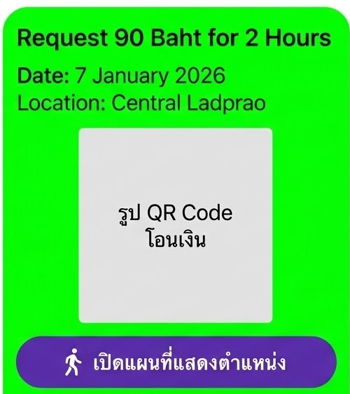

this project use postgres
if there it meed to make the table you can use the schema with the .env db for create the table

add image upload feature on chat

finnish the requestMoney system by
after tutor fill the request money form
it will show this message use the data from the form that tutor fill

show the qr code from the promtpay picture
for student i will shot as the image but for tutor i will also have edit the form and accept button too
the accept button just show the popup of successfully now
